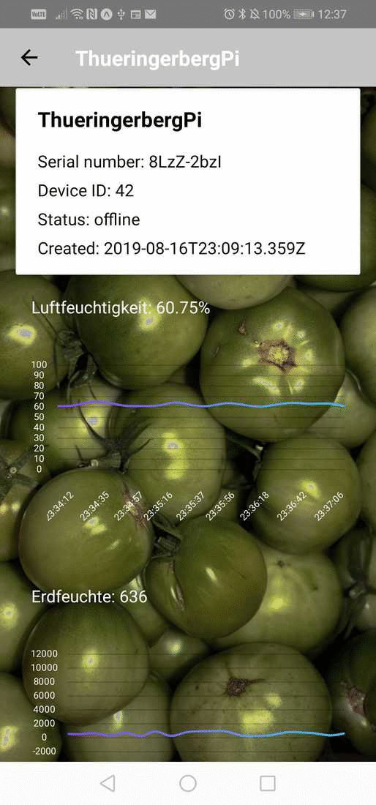

# raspalp-app

Simple Raspalp [React Native](https://facebook.github.io/react-native/) App for iOS and
Android, which allows to visualize live weather and soil moisture data recorded
by your Raspalp. The App is distributed through [Expo](https://expo.io/).

<p align="center">
  
</p>


## Running the app

You can either clone this repo and build the App yourself or get the latest 
build from https://expo.io/@auerl/raspalp-app. If you chose to build the app
yourself make sure you have the latest Android Studio (or xcode, if you are
on macOS), and a recent version of Node.js installed.

```
npm install -g expo-cli
cd raspalp-app
npm install
expo start
```

If you want to use yarn 


```
npm install -g yarn
yarn add global expo-cli
cd raspalp-app
yarn install
expo start
```

